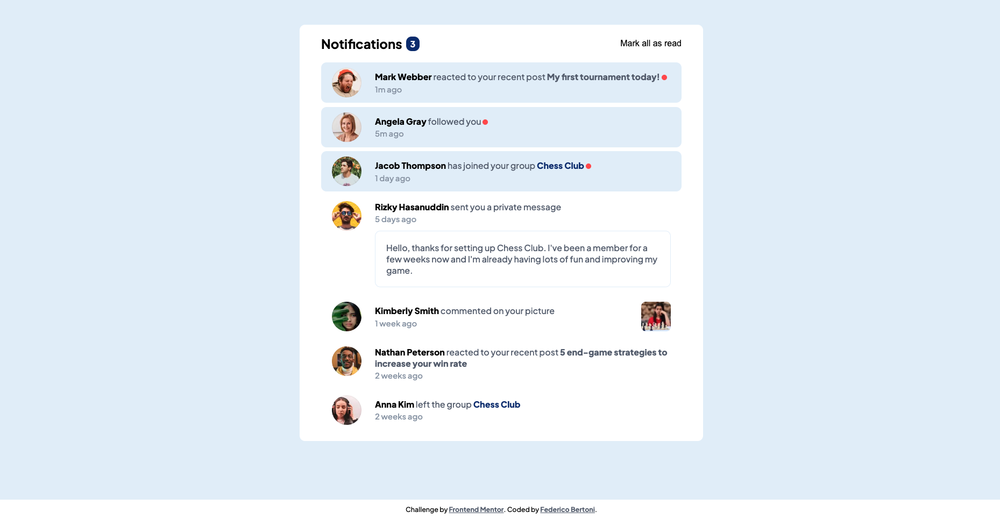
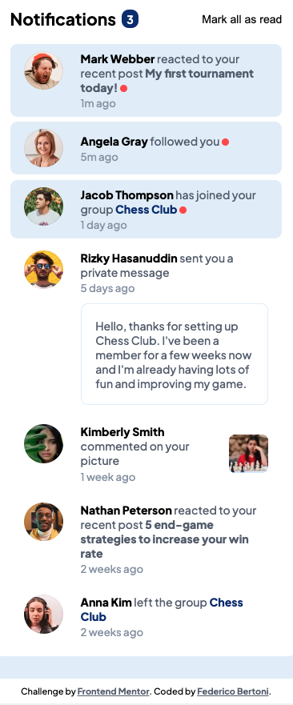

# Notifications page

This is a solution to the [Notifications page challenge on Frontend Mentor](https://www.frontendmentor.io/challenges/notifications-page-DqK5QAmKbC).

## Overview

### The challenge

Users should be able to:

- Distinguish between "unread" and "read" notifications
- Select "Mark all as read" to toggle the visual state of the unread notifications and set the number of unread messages to zero
- View the optimal layout for the interface depending on their device's screen size
- See hover and focus states for all interactive elements on the page

### Screenshot

## Author

- Live Preview - [Notifications page](https://fedechini.github.io/notifications-page-main/)
- Frontend Mentor - [Federico Bertoni](https://www.frontendmentor.io/profile/Fedechini)
